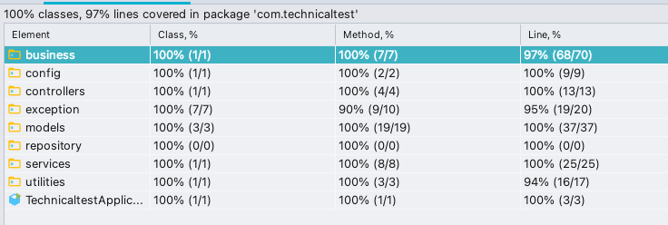

# TechnicalTest
This project was created with :
 * Java 8 
 * PostgreSQL 13
 * JPA
 * Spring Boot 2.4.5
 * Maven

### Guide to run in local 
* Install and configure a Postgresql DB
* Change the database parameters  `src/main/resources/application.properties` 
* Run Postgresql and run the API, you can run it in your preferred IDE 
  or use the command window run the following: `mvn spring-boot:run`
  
### URL API: https://mutantsapi.herokuapp.com/

#### Documentation Swagger
url : https://mutantsapi.herokuapp.com/swagger-ui.html

####Curl to validate if a DNA is mutant or human

```
curl --location --request POST 'https://mutantsapi.herokuapp.com/mutant' \
--header 'Content-Type: application/json' \
--data-raw '{"dna":[
    "ATGCGA",
    "AAGTGC",
    "TTATCT",
    "AGAAAG",
    "TCCCTA",
    "TCACTG"]}'
```

####Curl to view statistics 

```
curl --location --request GET 'https://mutantsapi.herokuapp.com/stats' \
--header 'Content-Type: application/json'
```

### Test coverage


